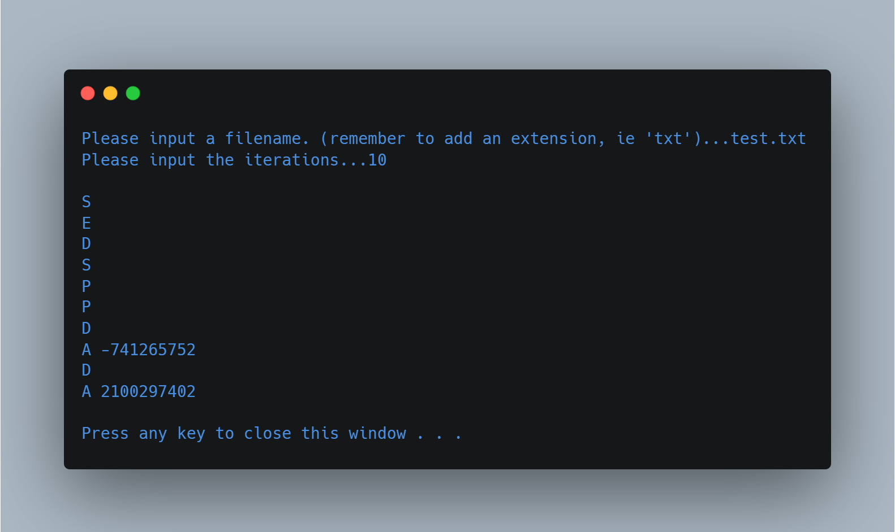

# Random Stream Generator

(FSC-BCS-370-HW1)

## Output

## Assignment Context

This project was the first of a three part series of assignments for my C++ Data Structures class.

The goal of this assignment was to generate a set of random letters and numbers to act as instructions for future parts.

This project was made using C++ in Visual Studio 2019.

## Features

This C++ code generates a random stream of characters and numbers and writes it to a file. 

It contains two different sequences of random numbers.
1. one for the letters, decided between 0 and 5 
2. one for the number to follow "A" between INT_MIN and INT_MAX.

## How It Works

The `randomStream` function takes two arguments: `filename`, which is a string representing the name of the file to which the output will be written, and `iterations`, an integer representing the number of lines to be written to the file. 

Inside the function, there are two random number generators initialized with `std::random_device` and `std::mt19937` and seeded with `rd1()` and `rd2()` respectively. 

The `dis1` and `dis2` objects are `std::uniform_int_distribution` objects that are used to generate random integers between 0 and 5, and between INT_MIN and INT_MAX (the minimum and maximum values of the int type), respectively.

The function then declares a temporary integer variable named `temp`, and an array of 6 strings called `letters`, which holds the letters "A", "D", "P", "E", "C", and "S". 

The `ofstream` object named `outputFile` is created, which is used to write the output to the file with the name specified in the `filename` argument.

The function then enters a `for` loop that will repeat `iterations` times. 

In each iteration of the loop, the `dis1` object is used to generate a random integer between 0 and 5, which is stored in the `temp` variable. 

If `temp` is equal to 0, the function writes the letter "A" to the output file, followed by a space and a random integer generated using the `dis2` object. 

If `temp` is not equal to 0, the function writes the letter at index `temp` of the `letters` array to the output file. 

If the current iteration is not the last iteration, the function also writes a newline character to the output file.

After the loop completes, the output file is closed with the `close()` method of the `outputFile` object.

The `main` function prompts the user to input a filename and the number of iterations, then calls the `randomStream` function with those inputs.
